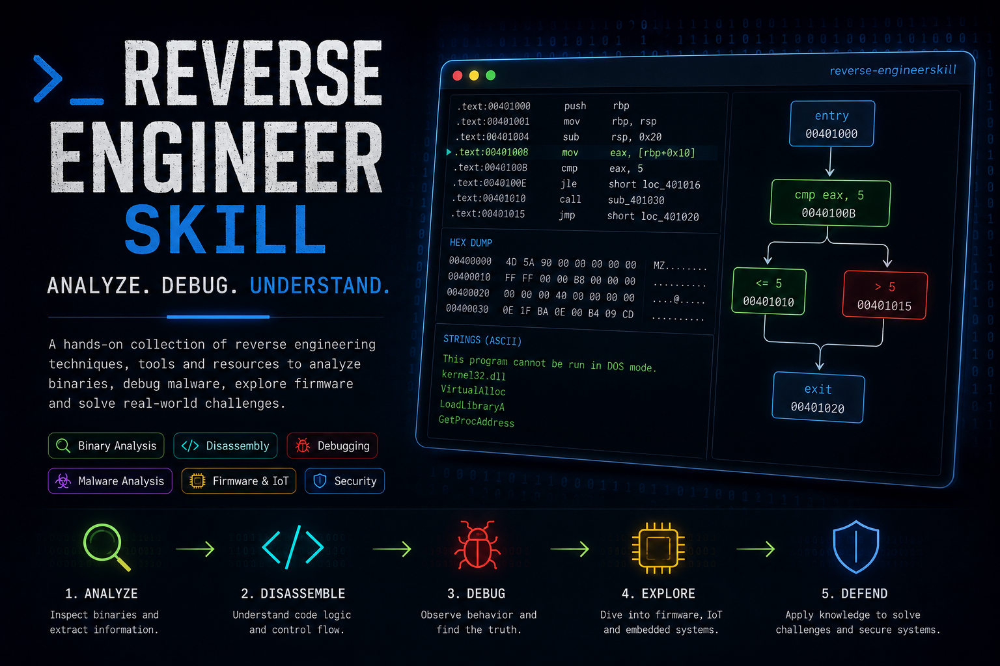
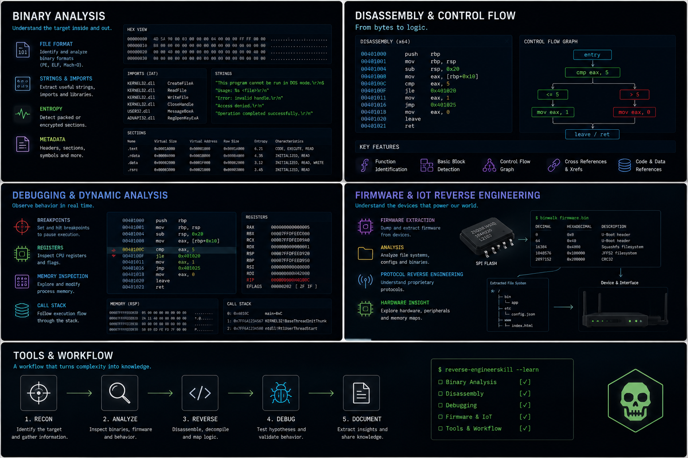

# Reverse Engineering Skill



A beginner-friendly agent skill for analyzing binaries, malware, firmware, and obfuscated code. Works with Claude Code, OpenCode, Codex, Cursor, and [70+ other agents](https://agentskills.io) that read the standard `SKILL.md` format.

## What this skill does

This skill teaches and guides a safe, repeatable reverse engineering workflow:

1. Triage and static analysis
2. Disassembly and decompilation
3. Dynamic analysis and debugging
4. Malware behavioral analysis
5. Firmware / IoT analysis
6. Reporting with IOCs and MITRE ATT&CK mapping

It is designed for beginners but includes practical commands, tools, and safety practices used by professionals.



## Installation

### Option 1: `npx skills` (recommended, multi-agent)

The [`skills`](https://www.npmjs.com/package/skills) CLI detects your installed agents and installs the skill for them with one command:

```bash
# Install globally so it is available in every project
npx skills add juank115/reverse-engineerskill --skill reverse-engineering -g -y

# Or install into the current project only
npx skills add juank115/reverse-engineerskill --skill reverse-engineering -y

# Target specific agents
npx skills add juank115/reverse-engineerskill --skill reverse-engineering -g -a claude-code -a opencode
```

### Option 2: Claude Code plugin (official)

This repository is also a Claude Code plugin marketplace, so you can install it from within Claude Code:

```text
/plugin marketplace add juank115/reverse-engineerskill
/plugin install reverse-engineering@reverse-engineering-skills
```

When installed as a plugin, invoke the skill as `/reverse-engineering:reverse-engineering`.

### Option 3: Provided install scripts

Clone this repository and run the installer for your platform. It links (or copies) the skill into the standard skill directories for Claude Code, OpenCode, and generic agents.

```bash
# macOS / Linux (symlink mode; use --copy to copy instead)
./install.sh

# Windows (junction mode; use -Copy to copy instead, -Force to skip prompts)
.\install.ps1
```

The installer asks before overwriting an existing skill.

### Option 4: Manual install

Symlink or copy `skills/reverse-engineering/` into any of these directories:

| Agent | Global path |
|-------|-------------|
| Claude Code | `~/.claude/skills/reverse-engineering/` |
| OpenCode | `~/.config/opencode/skills/reverse-engineering/` |
| Codex, Cursor, others | `~/.agents/skills/reverse-engineering/` |

```bash
# Example: macOS / Linux, Claude Code
mkdir -p ~/.claude/skills
ln -s "$(pwd)/skills/reverse-engineering" ~/.claude/skills/reverse-engineering
```

```powershell
# Example: Windows (PowerShell), Claude Code
New-Item -ItemType Junction -Path "$env:USERPROFILE\.claude\skills\reverse-engineering" -Target "$(Get-Location)\skills\reverse-engineering"
```

Restart your agent after installing.

## Usage

Once installed, mention reverse engineering tasks naturally:

- "Analyze this binary and tell me what it does."
- "Help me reverse engineer this suspicious file safely."
- "Decompile this function in Ghidra."
- "What IOCs can I extract from this malware sample?"

You can also invoke the skill directly: `/reverse-engineering` (or `/reverse-engineering:reverse-engineering` when installed as a Claude Code plugin).

## Repository layout

```
.claude-plugin/
├── plugin.json            # Claude Code plugin manifest (repo root is the plugin)
└── marketplace.json       # Claude Code marketplace catalog
assets/
├── banner.png             # README banner
└── overview.png           # README overview infographic
skills/
└── reverse-engineering/
    └── SKILL.md           # The skill definition
examples/
├── static-analysis.md     # Example session: static analysis workflow
└── dynamic-analysis.md    # Example session: dynamic analysis workflow
install.sh                 # macOS / Linux installer
install.ps1                # Windows installer
LICENSE
README.md
```

## Updating

- Installed with `npx skills`: run `npx skills update reverse-engineering`.
- Installed as a Claude Code plugin: run `/plugin marketplace update reverse-engineering-skills`.
- Installed with symlink/junction: `git pull` in this repository.
- Installed as a copy: re-run the installer or copy the new files.

## Safety notice

This skill is a guide. It does **not** execute malware for you. Always analyze unknown binaries in an isolated virtual machine, take snapshots, and avoid running suspicious executables on your host.

## License

MIT License — see [LICENSE](LICENSE).
