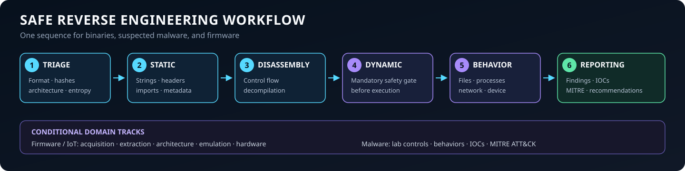

# Reverse Engineering Skill

[](LICENSE)
[](https://skills.sh/juank115/reverse-engineerskill)


A beginner-friendly agent skill for analyzing binaries, malware, firmware, and obfuscated code. Works with Claude Code, OpenCode, Codex, Cursor, and [70+ other agents](https://agentskills.io) that read the standard `SKILL.md` format.

## What this skill does

This skill teaches and guides a safe, repeatable reverse engineering workflow:

1. Triage
2. Static analysis
3. Disassembly and decompilation
4. Dynamic analysis and debugging
5. Behavioral analysis
6. Reporting with IOCs and MITRE ATT&CK mapping

Firmware / IoT is a conditional analysis domain, not a separate phase: firmware acquisition, extraction, native-code review, emulation, and observed behavior fit into the same six-phase workflow. Malware analysis follows the same workflow and adds malware-specific behavioral and IOC guidance.

It is designed for beginners but includes practical commands, tools, and safety practices used by professionals.



## What's inside the skill

The skill follows the [progressive disclosure](https://agentskills.io) pattern: a concise `SKILL.md` plus resources that load only when needed.

| Path | What it provides |
|------|------------------|
| `skills/reverse-engineering/SKILL.md` | Main workflow: safety, 6-phase analysis process, tool tables, output format |
| `skills/reverse-engineering/references/windows-pe.md` | PE deep dive: headers, imports, packers, manual unpacking |
| `skills/reverse-engineering/references/linux-elf.md` | ELF deep dive: headers, mitigations, GDB workflow, anti-analysis |
| `skills/reverse-engineering/references/malware-analysis.md` | Malware playbook: lab setup, MITRE-mapped behaviors, YARA, IOCs |
| `skills/reverse-engineering/references/firmware-iot.md` | Firmware playbook: binwalk, filesystems, emulation, UART/JTAG |
| `skills/reverse-engineering/references/cheatsheet.md` | x64dbg, GDB, radare2, Ghidra, WinDbg command lookup |
| `skills/reverse-engineering/references/static-analysis-example.md` | Beginner example: complete read-only static-analysis session |
| `skills/reverse-engineering/references/dynamic-analysis-example.md` | Beginner example: complete isolated dynamic-analysis session |
| `skills/reverse-engineering/scripts/triage.py` | Automated first-pass triage (hashes, entropy, section anomalies, anti-analysis clues, strings) — pure stdlib Python |
| `skills/reverse-engineering/assets/report-template.md` | Ready-to-fill analysis report template |

## Installation

### Option 1: `npx skills` (recommended, multi-agent)

The [`skills`](https://www.npmjs.com/package/skills) CLI detects your installed agents and installs the skill for them with one command:

```bash
# Install globally so it is available in every project
npx skills add juank115/reverse-engineerskill --skill reverse-engineering -g -y

# Or install into the current project only
npx skills add juank115/reverse-engineerskill --skill reverse-engineering -y

# Target specific agents
npx skills add juank115/reverse-engineerskill --skill reverse-engineering -g -a claude-code -a opencode -y
```

### Option 2: Claude Code plugin (official)

This repository is also a Claude Code plugin marketplace, so you can install it from within Claude Code:

```text
/plugin marketplace add juank115/reverse-engineerskill
/plugin install reverse-engineering@reverse-engineering-skills
```

When installed as a plugin, invoke the skill as `/reverse-engineering:reverse-engineering`.

### Option 3: Provided install scripts

Clone this repository and run the installer for your platform. It links (or copies) the skill into the standard skill directories for Claude Code, OpenCode, and generic agents.

```bash
# macOS / Linux (symlink mode; use --copy to copy instead)
./install.sh

# Windows (junction mode; use -Copy to copy instead, -Force to skip prompts)
.\install.ps1
```

The installer asks before overwriting an existing skill. Run `install.sh` in macOS, Linux, Git Bash, or WSL; it resolves the repository with native POSIX paths. Under WSL it installs into the **WSL user's** agent directories, even when the clone is under `/mnt/c`. To install for native Windows agents, run `install.ps1` from PowerShell instead.

The bundled Python triage and repository validation scripts require Python 3.10 or newer and use only the standard library.

### Option 4: Manual install

Symlink or copy `skills/reverse-engineering/` into any of these directories:

| Agent | Global path |
|-------|-------------|
| Claude Code | `~/.claude/skills/reverse-engineering/` |
| OpenCode | `~/.config/opencode/skills/reverse-engineering/` |
| Codex, Cursor, others | `~/.agents/skills/reverse-engineering/` |

```bash
# Example: macOS / Linux, Claude Code
mkdir -p ~/.claude/skills
ln -s "$(pwd)/skills/reverse-engineering" ~/.claude/skills/reverse-engineering
```

```powershell
# Example: Windows (PowerShell), Claude Code
New-Item -ItemType Junction -Path "$env:USERPROFILE\.claude\skills\reverse-engineering" -Target "$(Get-Location)\skills\reverse-engineering"
```

Restart your agent after installing.

## Usage

Once installed, mention reverse engineering tasks naturally:

- "Analyze this binary and tell me what it does."
- "Help me reverse engineer this suspicious file safely."
- "Decompile this function in Ghidra."
- "What IOCs can I extract from this malware sample?"

You can also invoke the skill directly: `/reverse-engineering` (or `/reverse-engineering:reverse-engineering` when installed as a Claude Code plugin).

## Repository layout

```
.claude-plugin/
├── plugin.json            # Claude Code plugin manifest (repo root is the plugin)
└── marketplace.json       # Claude Code marketplace catalog
.github/
├── scripts/validate_skills.py  # Repo validation (no dependencies)
└── workflows/validate.yml      # CI: runs validation on push/PR
assets/
├── banner.png             # README banner
└── workflow.svg           # Exact six-phase workflow and conditional domains
skills/
└── reverse-engineering/
    ├── SKILL.md           # The skill definition
    ├── references/        # Deep-dive guides and example sessions loaded on demand
    ├── scripts/triage.py  # Automated static triage (stdlib only)
    └── assets/report-template.md
install.sh                 # macOS / Linux installer
install.ps1                # Windows installer
CONTRIBUTING.md
LICENSE
README.md
```

## Updating

- Installed with `npx skills`: run `npx skills update reverse-engineering`.
- Installed as a Claude Code plugin: run `/plugin marketplace update reverse-engineering-skills`.
- Installed with symlink/junction: `git pull` in this repository.
- Installed as a copy: re-run the installer or copy the new files.

## Safety notice

This skill is a guide. It does **not execute the analyzed sample** during static triage: `triage.py` is the program being run, and it opens the target file as read-only bytes without importing or launching it. Dynamic-analysis commands are different; the skill requires explicit verification of VM isolation, rollback, network containment, monitoring, and secret-free conditions before giving or using commands that run or debug an unknown sample. Never run suspicious executables on your host.

## License

MIT License — see [LICENSE](LICENSE).
